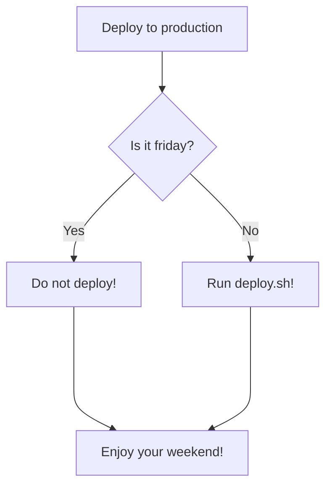

# Flowchart in Markdown files

```mermaid
flowchart TD
  A[Deploy to production] --> B{Is it friday?};
  B -- Yes --> C[Do not deploy!];
  B -- No --> D[Run deploy.sh!];
  C ----> E[Enjoy your weekend!];
  D ----> E[Enjoy your weekend!];
```
